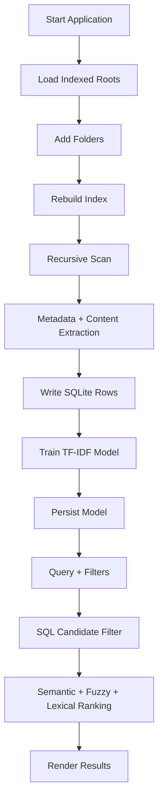
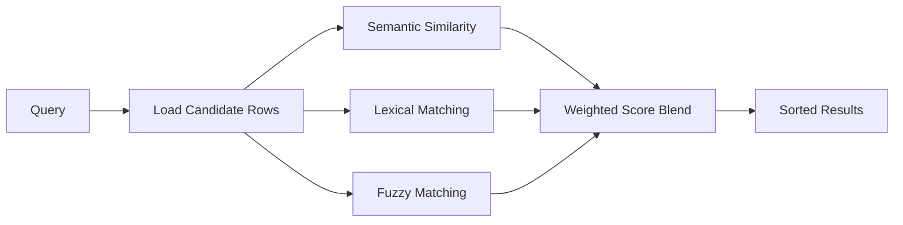

# Flow Diagrams

## Application Flow

```mermaid
flowchart TD
    A[Start Application] --> B[Load Indexed Roots]
    B --> C[Add Folders]
    C --> D[Rebuild Index]
    D --> E[Recursive Scan]
    E --> F[Metadata + Content Extraction]
    F --> G[Write SQLite Rows]
    G --> H[Train TF-IDF Model]
    H --> I[Persist Model]
    I --> J[Query + Filters]
    J --> K[SQL Candidate Filter]
    K --> L[Semantic + Fuzzy + Lexical Ranking]
    L --> M[Render Results]
```

## Search Flow

```mermaid
flowchart LR
    A[Query] --> B[Load Candidate Rows]
    B --> C[Semantic Similarity]
    B --> D[Lexical Matching]
    B --> E[Fuzzy Matching]
    C --> F[Weighted Score Blend]
    D --> F
    E --> F
    F --> G[Sorted Results]
```
